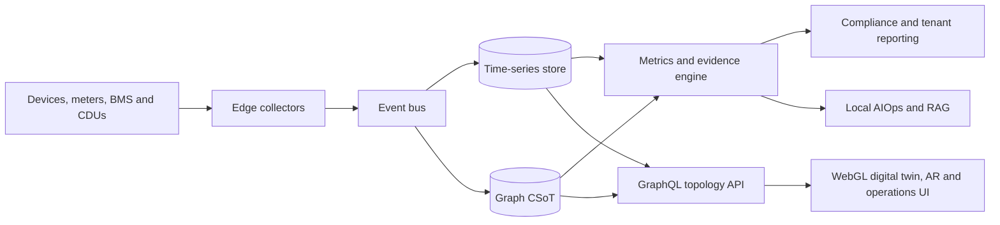

# Next-Generation AI-Driven DCIM Platform

An autonomous **Data Center Infrastructure Management (DCIM)** platform designed as a Cognitive Source of Truth (CSoT). It combines graph-based topology, streaming telemetry, detailed power and cooling supervision, a WebGL digital twin, and an air-gapped AIOps engine.

## Core capabilities

- **Graph-first CSoT:** Models spatial, electrical, cooling, network, application, tenant, and contractual relationships for blast-radius and dependency analysis.
- **Power and battery supervision:** Tracks the complete electrical chain from grid and generator to UPS, PDU, rack, device, and individual battery cell.
- **Liquid-cooling operations:** Monitors cooling distribution units (CDUs), loops, flow, supply and return temperature, differential pressure, coolant quality, pumps, leaks, and delivered thermal capacity.
- **European reporting readiness:** Produces traceable PUE, WUE, ERF, renewable-energy, waste-heat, and related datasets for Regulation (EU) 2024/1364 and national reporting workflows.
- **PUE/WUE label readiness:** Calculates clearly marked internal previews of the separate A-G PUE and WUE classes, while preserving the official EU database-generated label and QR code as the authoritative record.
- **Waste-heat management:** Measures recoverable and reused heat, records feasibility evidence, and evaluates jurisdiction-specific rules such as the German 10/15/20% reuse targets.
- **Multi-tenant sustainability:** Allocates metered energy and shared facility overhead through versioned rules, calculates tenant partial PUE, and exports auditable evidence for CSRD/ESRS reporting.
- **3D Digital Twin and AR:** Renders sites, rooms, racks, power paths, liquid loops, and thermal or airflow heatmaps in the browser.
- **Local AIOps and Copilot:** Runs predictive maintenance, anomaly detection, thermal-runaway detection, placement optimization, and natural-language assistance on premises.
- **Agentless discovery:** Ingests gRPC telemetry, Modbus TCP, BACnet/IP, eBPF, Redfish, SNMPv3, LLDP/CDP, and computer-vision observations.

## Regulatory status

The platform is designed to support regulatory reporting, not to replace legal review or certification. Regulation (EU) 2024/1364 defines the EU reporting data and KPI calculations. The Commission adopted `C(2026) 3472 final` on 21 September 2026 to establish separate PUE and WUE A-G ratings, but on the documentation baseline date (25 September 2026) its Official Journal publication and entry into force still need to be verified. The application must never present an internally calculated preview as the official EU label.

Heat-reuse thresholds and CSRD applicability depend on jurisdiction, organization, reporting period, and transitional rules. They are therefore represented as versioned policies rather than hard-coded global claims.

See [Regulatory Compliance Baseline](docs/regulatory-compliance.md) for the legal-source mapping and [Functional Requirements](docs/functional-requirements.md) for acceptance criteria.

## System architecture



The local development stack provides Neo4j, ClickHouse, Redpanda, Qdrant, and Ollama through `docker-compose.yml`. The implemented `dcim-topology-service` currently manages racks and mounted devices and publishes GraphQL subscriptions. The `web/` Next.js app is the bilingual operations UI (platform overview + power-chain supervision). The broader compliance, CDU, heat-reuse, and tenant-allocation modules described in the specifications remain product requirements until implemented and tested.

## Documentation

- [Functional Requirements Document](docs/functional-requirements.md)
- [Regulatory Compliance Baseline](docs/regulatory-compliance.md)
- [Technical Architecture](docs/technical-architecture.md)
- [Operations Web UI](web/README.md)
- [Topology Service](dcim-topology-service/README.md)
- [Multi-pod WebSocket Deployment](dcim-topology-service/deploy/README.md)

## Local infrastructure

```bash
docker compose up -d
cd web && cp .env.example .env.local && npm install && npm run dev
```

The UI listens on [http://localhost:3000](http://localhost:3000) (`/fr` by default, power view at `/fr/power`). It talks to GraphQL at `NEXT_PUBLIC_GRAPHQL_URL` and ClickHouse at `CLICKHOUSE_URL`, and falls back to mock telemetry when those services are offline.

Do not use the example credentials from `docker-compose.yml` in production. Production deployments require managed secrets, encryption, backups, retention policies, tenant isolation, and a validated evidence-export process.
