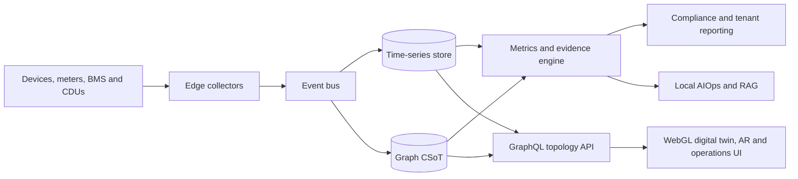

# Next-Generation AI-Driven DCIM Platform

An autonomous **Data Center Infrastructure Management (DCIM)** platform designed as a Cognitive Source of Truth (CSoT). It combines graph-based topology, streaming telemetry, detailed power and cooling supervision, a WebGL digital twin, and an air-gapped AIOps engine.

**Live product preview:** [dcim-web.vercel.app](https://dcim-web.vercel.app/) (French and English UI). The hosted application is a preview: pages can display demo or fallback data when the on-premises GraphQL, ClickHouse, or Rust services are unavailable.

## Core capabilities

- **Graph-first CSoT:** Models spatial, electrical, cooling, network, application, tenant, and contractual relationships for blast-radius and dependency analysis.
- **Power and battery supervision:** Tracks the complete electrical chain from grid and generator to UPS, PDU, rack, device, and individual battery cell.
- **Liquid-cooling operations:** Monitors cooling distribution units (CDUs), loops, flow, supply and return temperature, differential pressure, coolant quality, pumps, leaks, and delivered thermal capacity.
- **European reporting readiness:** Produces traceable PUE, WUE, ERF, renewable-energy, waste-heat, and related datasets for Regulation (EU) 2024/1364 and national reporting workflows.
- **PUE/WUE label readiness:** Calculates clearly marked internal previews of the separate A-G PUE and WUE classes, while preserving the official EU database-generated label and QR code as the authoritative record.
- **Waste-heat management:** Measures recoverable and reused heat, records feasibility evidence, and evaluates jurisdiction-specific rules such as the German 10/15/20% reuse targets.
- **Multi-tenant sustainability:** Allocates metered energy and shared facility overhead through versioned rules, calculates tenant partial PUE, and exports auditable evidence for CSRD/ESRS reporting.
- **3D Digital Twin and AR:** Renders sites, rooms, racks, power paths, liquid loops, and thermal or airflow heatmaps in the browser.
- **Local AIOps and Copilot:** Runs predictive maintenance, anomaly detection, thermal-runaway detection, placement optimization, and natural-language assistance on premises.
- **Agentless discovery:** Ingests gRPC telemetry, Modbus TCP, BACnet/IP, eBPF, Redfish, SNMPv3, LLDP/CDP, and computer-vision observations.

## Regulatory status

The platform is designed to support regulatory reporting, not to replace legal review or certification. Regulation (EU) 2024/1364 defines the EU reporting data and KPI calculations. The Commission adopted `C(2026) 3472 final` on 21 September 2026 to establish separate PUE and WUE A-G ratings, but on the documentation baseline date (25 September 2026) its Official Journal publication and entry into force still need to be verified. The application must never present an internally calculated preview as the official EU label.

Heat-reuse thresholds and CSRD applicability depend on jurisdiction, organization, reporting period, and transitional rules. They are therefore represented as versioned policies rather than hard-coded global claims.

See [Regulatory Compliance Baseline](docs/regulatory-compliance.md) for the legal-source mapping and [Functional Requirements](docs/functional-requirements.md) for acceptance criteria.

## System architecture


```mermaid
flowchart LR
    A[Devices, meters, BMS and CDUs] --> B[Edge collectors]
    B --> C[Event bus]
    C --> D[(Time-series store)]
    C --> E[(Graph CSoT)]
    D --> F[Metrics and evidence engine]
    E --> F
    F --> G[Compliance and tenant reporting]
    E --> H[GraphQL topology API]
    D --> H
    H --> I[WebGL digital twin, AR and operations UI]
    F --> J[Local AIOps and RAG]
```

The local development stack provides Neo4j, ClickHouse, Redpanda, Qdrant, and Ollama through `docker-compose.yml`. The tracked implementation includes a bilingual Next.js operations UI, a NestJS GraphQL service for rack, device, and network topology, initial Keycloak integration, a Rust gateway and domain crates, and a local monitoring overlay. Several UI paths still rely on demo or in-memory fallback data. Durable regulatory evidence, on-site hardware validation for telemetry ingestion, per-tenant scoping of the remaining REST/web routes, and the local AI engine remain incomplete.

## Current implementation status

| Area | Available today | Main gap before production |
| --- | --- | --- |
| Web application | Bilingual UI, topology and network views, power and sustainability metrics, EED preview, alert inbox, explicit live/demo data policy | Replace remaining demonstrations with validated production connectors and operational data paths |
| Topology API | Neo4j-backed rack/device/network GraphQL operations, subscriptions, resolver-level authorization, Keycloak groundwork | Migrate reads to the canonical property convention after Nest retirement; keep expanding automated tests |
| Rust services | PUE/WUE core, HTTP gateway, ClickHouse and Redfish foundations, Neo4j-backed GraphQL topology, resolver authorization, hardened JWKS, collector service tokens | Production-grade multi-pod subscriptions (durable bus) and canonical-property cleanup after the parallel-read period |
| Telemetry and operations | Docker Compose, ClickHouse, Redpanda, Prometheus, Grafana, Telegraf and BMS read/write interlock examples | Validate end-to-end ingestion, persistence, replay, alerting, backups, and deployment hardening |
| Compliance and evidence | Requirements, regulatory baseline, metric previews, and EED demonstration UI | Implement versioned rules, quality gates, immutable snapshots, review workflow, exports, receipts, and official-label reconciliation |

## Development priorities

| Priority | Status | Workstream | Completion outcome |
| --- | --- | --- | --- |
| **P0** | **Complete (27 Sep 2026)** | Restore the delivery baseline | Web, NestJS, and Rust builds pass; reproducible lockfiles are tracked; GitHub Actions runs build, lint, test, and Rust format/clippy checks on every pull request |
| **P0** | **Complete (27 Sep 2026)** | Security and dependency maintenance | Next.js and the npm dependency chains are upgraded with zero high-severity npm audit findings; Dependabot, dependency review, and secret scanning are configured; supported runtimes are documented |
| **P1** | **In progress** | Durable operational data path | Explicit demo mode, fail-visible sources, Neo4j-backed Rust topology and a durable spool with idempotent replay (validated end-to-end on a real ClickHouse) are implemented; remaining: on-site hardware validation and retention policy |
| **P1** | **In progress** | Identity and tenant isolation | RBAC/ABAC and tenant boundaries enforced on HTTP, GraphQL, subscriptions and machine routes, with negative tests, audit logging and collector service tokens; remaining: tenant scoping of the REST/web data routes and AI-retrieval filtering before the copilot activates |
| **P1** | **Next** | Regulatory evidence engine | Ship effective-dated PUE/WUE/ERF rules, data-quality gates, tenant allocation, locked evidence snapshots, four-eyes review, EU/national exports, submission receipts, and official-label reconciliation |
| **P2** | **In progress** | Production operations | Liveness/readiness probes, hardened containers, an HA gateway manifest, initial SLOs, backup/restore tooling with isolated restore exercises, and a digest-pinned image publish workflow are implemented; migrations, TLS automation, tracing, production-proven restores, retention, and full DR exercises remain |
| **P2** | **Later** | Advanced product capabilities | Connect the WebGL digital twin to live topology and telemetry, complete CDU/liquid-cooling and heat-reuse workflows, then validate predictive AIOps and the air-gapped copilot with human controls |

The next milestone is **P1: durable operational data and tenant isolation**. Requirements and acceptance criteria are maintained in the [Functional Requirements](docs/functional-requirements.md); the Rust migration sequence is described in the [Rust roadmap](docs/rust-roadmap.md).

## Supported development baseline

- **Node.js:** 22.22.3 LTS (`.nvmrc`; package engines also accept Node 24.15 or newer within the Node 24 line)
- **npm:** 10 or newer
- **Rust:** current stable toolchain with `rustfmt` and `clippy`

The CI-equivalent checks are:

```bash
cd web
npm ci
npm audit --audit-level=high
npm run lint && npm run typecheck && npm test && npm run build

cd ../dcim-topology-service
npm ci
npm audit --audit-level=high
npm test

cd ../crates
cargo fmt --all -- --check
cargo clippy --workspace --all-targets --all-features -- -D warnings
cargo test --workspace --all-features
```

Docker-free local full-stack (WSL2, no Docker): see [`ops/local/README.md`](ops/local/README.md).

## Metrics and supervision

Product UI (see [web/METRICS.md](web/METRICS.md)):

| Page | Route |
| --- | --- |
| Ensemble PUE · WUE · CUE · ERF | `/fr/metriques` |
| Calculatrices | `/fr/outils/pue` `wue` `cue` `erf` |
| Puissance live | `/fr/power` |
| EED | `/fr/eed` |
| Jumeau 3D · console thermique | `/fr/jumeau` · `/fr/topologie/thermique` |
| Supervision + inbox alertes | `/fr/supervision` |

APIs : `POST /api/metrics/{pue,wue,cue,erf}`, `GET /api/metrics/live?rack=`, `GET|POST /api/alerts`.

Ops overlay (local, not Cloud):

```bash
docker compose -f docker-compose.yml -f docker-compose.monitor.yml --profile monitor up -d
```

| Service | URL |
| --- | --- |
| Grafana | http://localhost:3001 (`admin` / `GRAFANA_PASSWORD`, default `qinode`) |
| Prometheus | http://localhost:9090 |

Telegraf (SNMP/Redfish) → ClickHouse. Grafana alerting → webhook `POST /api/alerts` → table `dcim.alerts`. Docs: [ops/MONITORING.md](ops/MONITORING.md).

## Documentation

- [Functional Requirements Document](docs/functional-requirements.md)
- [Regulatory Compliance Baseline](docs/regulatory-compliance.md)
- [Technical Architecture](docs/technical-architecture.md)
- [Live and demonstration data modes](docs/data-modes.md)
- [Operations Web UI](web/README.md)
- [Metrics map](web/METRICS.md)
- [Monitoring overlay](ops/MONITORING.md)
- [Production operations readiness](docs/operations-readiness.md)
- [Go-live checklist](docs/go-live.md)
- [Backup and restore tooling](ops/backup/README.md)
- [Load smoke (k6)](ops/load/README.md)
- [Topology Service](dcim-topology-service/README.md)
- [Multi-pod WebSocket Deployment](dcim-topology-service/deploy/README.md)

## Local infrastructure

```bash
docker compose up -d
cd web && cp .env.example .env.local && npm ci && npm run dev
```

The UI listens on [http://localhost:3000](http://localhost:3000) (`/fr` by default, power view at `/fr/power`). It talks to GraphQL at `NEXT_PUBLIC_GRAPHQL_URL` and ClickHouse at `CLICKHOUSE_URL`. Missing live sources fail visibly; sample telemetry is enabled only when both documented demo-mode flags are set explicitly.

Do not use the example credentials from `docker-compose.yml` in production. Production deployments require managed secrets, encryption, backups, retention policies, tenant isolation, and a validated evidence-export process.
