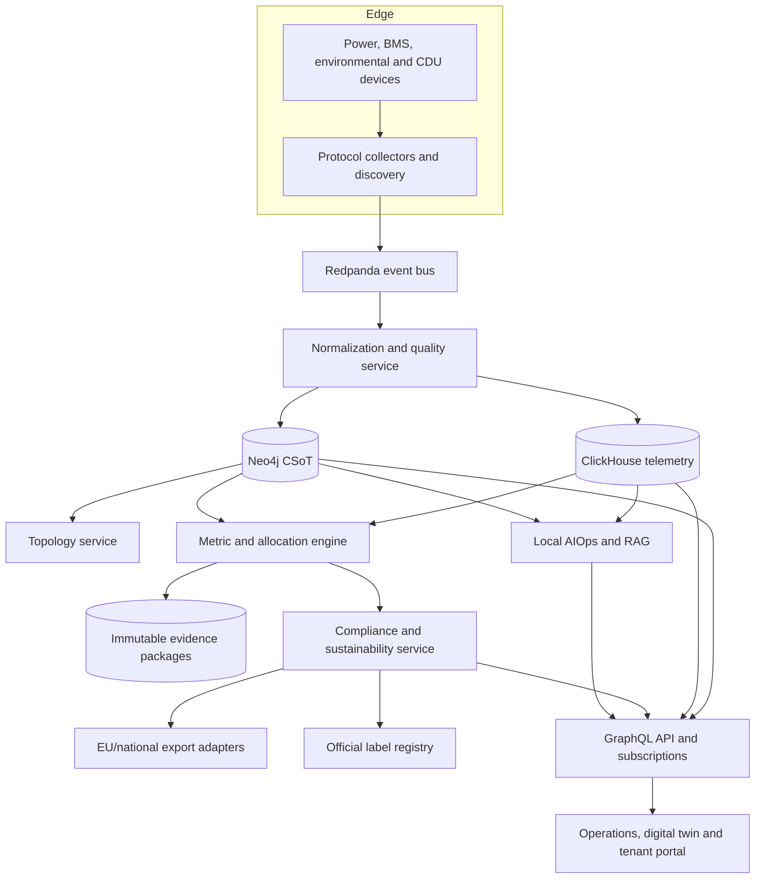

# Technical Architecture and Infrastructure Specification

| Field | Value |
| --- | --- |
| Project | Next-Generation AI-Driven DCIM Platform |
| Document version | 2.0 |
| Baseline date | 25 September 2026 |
| Target repository | `Geoking2104/DCIM` |
| Status | Approved architecture baseline |

## 1. Purpose and principles

This document defines the target architecture for the platform. It distinguishes implemented components from target capabilities and translates the [Functional Requirements](functional-requirements.md) into service, data, security, and deployment boundaries.

1. **Graph-first topology:** Neo4j is the source of truth for relationships among sites, electrical paths, cooling loops, assets, applications, tenants, meters, and evidence.
2. **Event-driven telemetry:** High-volume observations are immutable events before they are normalized and stored in ClickHouse.
3. **Evidence before claims:** Every reported value retains source, unit, interval, quality status, aggregation method, allocation rule, and calculation version.
4. **Rules are versioned:** EU, Member State, and customer rules are effective-dated configuration. No jurisdiction-specific threshold is a global constant.
5. **Official artifacts stay authoritative:** Internal PUE/WUE rating previews are visibly non-official. Official labels and QR codes are imported from and reconciled with the EU database.
6. **Tenant isolation by design:** Authentication, authorization, queries, subscriptions, exports, caches, and logs enforce tenant boundaries.
7. **Air-gapped operation:** AI inference, embeddings, vector search, and operational data remain on premises unless an authorized deployment explicitly enables an external integration.
8. **Client-side visualization:** WebGL and WebXR clients consume bounded GraphQL queries, subscriptions, and time-series tiles instead of loading the whole graph.

## 2. Logical architecture



The current repository implements the first topology-service slice. Boxes not backed by code are target components, not statements of current functionality.

## 3. Domain services

| Service | Responsibility | Primary storage |
| --- | --- | --- |
| Discovery and collectors | Poll or subscribe to Redfish, SNMPv3, Modbus TCP, BACnet/IP, gRPC, LLDP/CDP, and approved eBPF sources | Event bus |
| Normalization and quality | Canonical units, clock alignment, deduplication, validation, coverage and estimation flags | Event bus / ClickHouse |
| Topology | Spatial, power, cooling, logical and tenant relationships; impact traversal | Neo4j |
| Power and BMS | Electrical topology, power quality, capacity, battery SoC/SoH and cell anomalies | Neo4j / ClickHouse |
| Cooling | Air and liquid loops, CDU state, thermal performance, leaks and alarms | Neo4j / ClickHouse |
| Metric and allocation | Period aggregates, PUE/WUE/ERF and tenant allocation calculations | ClickHouse / evidence store |
| Compliance | Applicability, deadlines, validation, exports, submission receipts and official labels | Relational metadata / object evidence store |
| Sustainability | Energy mix, contractual instruments, hourly matching, emissions and CSRD/ESRS evidence | ClickHouse / evidence store |
| AIOps | On-premises anomaly detection, prediction, explanation and retrieval | Qdrant / model store |

## 4. Graph and telemetry model

### 4.1 Core graph entities

The target graph includes `Organization`, `Tenant`, `Site`, `DataCentre`, `Building`, `Room`, `Rack`, `Device`, `PowerPath`, `CoolingLoop`, `CDU`, `HeatRecoveryInterface`, `Meter`, `Sensor`, `Application`, `ReportingPeriod`, `AllocationRule`, `EvidencePackage`, and `OfficialLabel`.

Representative relationships include:

- `Tenant-[:OCCUPIES]->Space` and `Tenant-[:OWNS|OPERATES]->Device`
- `Meter-[:MEASURES]->Asset|TenantBoundary|UtilityBoundary`
- `Device-[:POWERED_BY]->PowerPath`
- `Rack-[:COOLED_BY]->CDU-[:CONNECTED_TO]->CoolingLoop`
- `HeatRecoveryInterface-[:EXPORTS_HEAT_TO]->HeatConsumer`
- `ReportingPeriod-[:USES_RULESET]->RegulatoryRuleSet`
- `EvidencePackage-[:SUPPORTS]->ReportedMetric`
- `OfficialLabel-[:ISSUED_FOR]->DataCentre`

All regulated relationships are effective-dated and retain provenance. Deleting an asset must not delete historical reporting evidence.

### 4.2 Telemetry envelope

Every observation contains at least:

```text
event_id, observed_at, ingested_at, source_id, point_id, tenant_scope,
value, unit, quality_code, estimated, calibration_id, sequence, schema_version
```

Raw events are retained according to policy. Corrected values are appended, never silently overwritten. Aggregates link to their contributing points and quality summaries.

### 4.3 Metric semantics

- `PUE = E_DC / E_IT` using the boundaries and interval treatment in the applicable rule set.
- WUE is rule-versioned: the in-force 2024 baseline uses `W_IN / E_IT` with `E_IT` expressed in MWh; the adopted 2026 amendment would use `W_IN-FRE / E_IT` with `E_IT` expressed in kWh once it enters into force. Both total-water and freshwater inputs are retained so prior and future periods remain reproducible.
- `ERF = E_REUSE / E_DC`.
- Tenant partial PUE is an allocation metric: `(tenant IT energy + allocated facility overhead) / tenant IT energy`. It is not represented as the facility-wide EU PUE and always carries the allocation-method version.
- CUE and greenhouse-gas values retain emission-factor source, geography, period, market/location method, contractual-instrument treatment, and uncertainty.

The calculation engine uses decimal arithmetic, explicit unit conversions, test vectors, and immutable formula versions. A recomputation creates a new result linked to the superseded result.

## 5. Regulatory evidence pipeline

```mermaid
flowchart LR
    RAW[Raw signed telemetry] --> QA[Coverage and quality gates]
    QA --> AGG[Period aggregation]
    AGG --> CALC[Versioned calculations]
    CALC --> REVIEW[Four-eyes review]
    REVIEW --> SNAP[Locked reporting snapshot]
    SNAP --> EXPORT[Schema-specific export]
    EXPORT --> RECEIPT[Submission receipt and reconciliation]
    RECEIPT --> OFFICIAL[Official label/QR registry]
```



Each snapshot records the legal/rule-set version, reporting perimeter, time zone, facility capacity, applicability decision, source coverage, estimates, exclusions, corrections, approvers, export checksum, submission response, and official artifacts. An internal A-G preview must include `official=false`, the calculation version, and a disclaimer. Only a label returned by the designated authority may have `official=true`.

## 6. Liquid-cooling architecture

The cooling domain models facility water, primary and secondary loops, CDUs, manifolds, rack loops, cold plates or immersion systems, heat exchangers, pumps, valves, filters, leak zones, and heat-recovery interfaces.

Required CDU signals include operational state, supply/return temperature, flow, pressure and differential pressure, pump speed, valve position, cooling capacity, heat removed, approach temperature, coolant conductivity, pH where applicable, filter state, leak detection, alarm state, redundancy state, setpoints, and sensor quality. Vendor-specific points map to canonical names without discarding raw values.

Alarms are derived from equipment envelopes and rate-of-change rules, not universal constants. Topology traversal identifies affected racks, tenants, applications, and available redundant paths.

## 7. Multi-tenant allocation and reporting

Tenant calculations use a metering hierarchy and one effective-dated allocation rule per shared cost pool. Supported allocation bases include direct metering, contracted capacity, occupied space, rack count, IT energy, and an approved custom driver. Direct measurements take precedence over allocation.

The service must:

- prevent cross-tenant reads in REST/GraphQL, subscriptions, exports, caches, traces, and AI retrieval;
- reconcile allocated totals to the facility total within configured tolerance;
- expose direct, allocated, estimated, excluded, and unallocated amounts separately;
- provide both location-based and market-based Scope 2 views where data permits;
- preserve energy-attribute certificate, PPA, residual-mix, and hourly matching evidence;
- export evidence that can support CSRD/ESRS processes without claiming that the export alone establishes compliance.

## 8. API and event contracts

GraphQL is used for interactive topology and reporting queries. `graphql-ws` carries subscriptions. A Redis-backed PubSub broker is mandatory for multi-replica subscription delivery; ingress affinity only improves connection stability.

Domain events use versioned schemas, an idempotency key, aggregate identifier, tenant scope, occurred-at timestamp, trace identifier, and producer version. Sensitive telemetry is not placed in event headers. Backward-compatible consumers must tolerate additive fields.

## 9. Security and non-functional controls

- OIDC authentication, role- and attribute-based authorization, and least privilege.
- Separate platform, operator, auditor, and tenant roles; privileged actions require step-up authentication where configured.
- Encryption in transit and at rest; secrets supplied by a secret manager, never committed.
- Tamper-evident audit trail for configuration, formulas, allocations, approvals, exports, and official-label changes.
- Backup and restore tests for graph, time-series, metadata, and evidence stores.
- Data retention and legal-hold policies by record class and jurisdiction.
- High-availability collectors with buffering during network partitions and deterministic replay.
- SLOs and scale targets are recorded per deployment; regulatory jobs expose completeness, lateness, failure and reconciliation metrics.
- AI output is advisory. It cannot submit a filing, alter an approved snapshot, or operate high-voltage equipment without an authorized human workflow.

## 10. Deployment profiles

The root `docker-compose.yml` is a local developer profile. It is not a production or compliance-certified deployment. Kubernetes production profiles require managed secrets, persistent storage classes, network policies, TLS, backups, observability, per-tenant authorization tests, and a Redis broker for WebSocket fan-out.

See the [topology deployment guide](../dcim-topology-service/deploy/README.md) for the current WebSocket examples and the [Regulatory Compliance Baseline](regulatory-compliance.md) for the source-of-law mapping.

## 11. Architecture decisions still required

- Select the relational metadata and immutable evidence/object stores.
- Confirm EU and national export schemas when competent authorities publish machine-readable contracts.
- Define reporting-data retention by jurisdiction and customer contract.
- Approve calculation libraries against regulatory test vectors.
- Choose tenant identity federation and row/graph isolation mechanisms.
- Define a controlled process for legal-rule monitoring and rule-set promotion.
